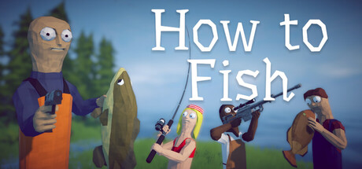
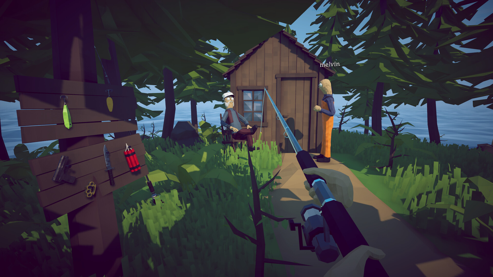
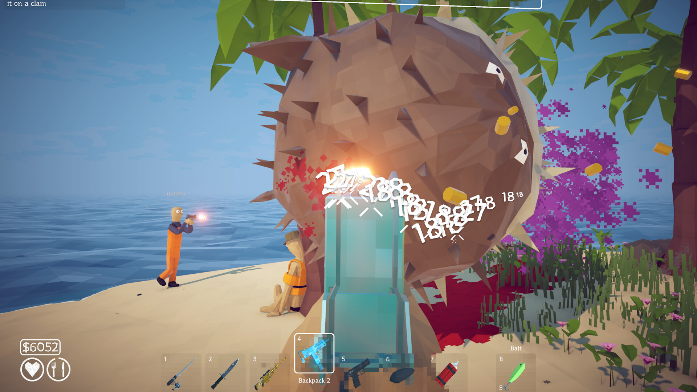

# How to Fish Game Progression Toolkit

How to Fish progression tools for PC with catch progression controls, equipment budgets, island practice and reusable session profiles. Adjust your setup, repeat a difficult encounter and spend more time exploring the islands.

---

## Download

---

## Game Gallery

 

## Features

| Feature | What it does |
|---|---|
| **Catch progression** | Adjust catch progression to match the pace of your run. |
| **Equipment budget** | Set equipment and inventory values for the setup you want to use. |
| **Island practice** | Keep separate profiles for island encounters and repeat them with different equipment. |
| **Resource spending** | Adjust resource consumption during fishing and exploration. |
| **Session profiles** | Manage solo and private co-op settings in separate profiles. |
| **Baseline restoration** | Return to your saved starting state after a practice session. |

## Profiles

Prepare two equipment setups, save a starting profile and compare them on the same island. Keep your preferred configuration for the next session.

## Getting Started

1. Open the **Download** link above.
2. Download the PC package and follow the included setup instructions.
3. Launch How to Fish and open the application.
4. Select the game profile and the options you want to use.
5. Save your configuration for the next session.

## Project Information

| Item | Details |
|---|---|
| Game | How to Fish |
| Platform | Windows / PC |
| Focus | Fishing progression / Equipment / Islands / Resources / Session profiles |
| Download | [PC package](https://flyn.im/6PCpxq) |

## FAQ

<strong>What does this toolkit include?</strong>

Catch progression, Equipment budget, Island practice, Resource spending, Session profiles, Baseline restoration.

<strong>Where can I download the application?</strong>

Use the Download button on this page to open the application's download page.

## Quick Download

---

Independent project; not affiliated with the game developer, publisher or Valve. Gallery images depict the game. See [image credits](assets/CREDITS.md), [sources](SOURCES.md) and the [license](LICENSE).
